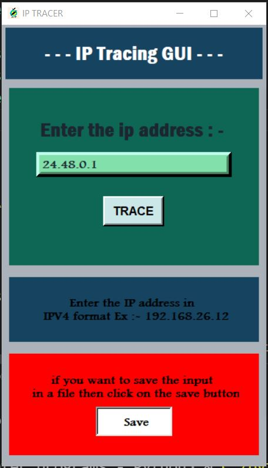
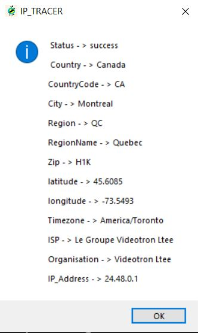

<h1 align="center">Hi I'm Cyber_Adi</h1>

## This tool is written in Python Language .

### As the Name of the Tool Says that this tool is used to find information about someones ip \n ip means internet protocol 
### The Following things you can find about an ip address

<strong>
<li>Status</li>
<li>Country</li>
<li>Country Code</li>
<li>City</li>
<li>Latitude</li>
<li>Longitude</li>
<li>Region</li>
<li>Region Name</li>
<li>Zip Code</li>
<li>Time Zone</li>
<li>Internet Service Provider</li>
<li>Organisation</li>
</strong>

#### If you want to make changes with that tool you can .

#### The Following libraries used in this tool are :-
<strong>
<li>Tkinter</li>
<li>os</li>
<li>requests</li>
</strong>

<h1>
IP Tracer
</h1>

### For Installing it in your debian or Linux System
#### Open The Terminal and Run That command 

<code>sudo apt install python,python2,python3</code> 
<code>sudo apt install git</code> 
<code>git clone https://github.com/aditya12-cyber/Cyber_Tools/IP_Tracer/</code> 
<code>cd</code> 
<code>ls</code> 
<code>cd IP_Tracer</code> 
<code>ls</code> 
<code>python3 IP_Tracer.py</code> 

### IF YOU LIKE 👍 That tool you can follow me on Github 

