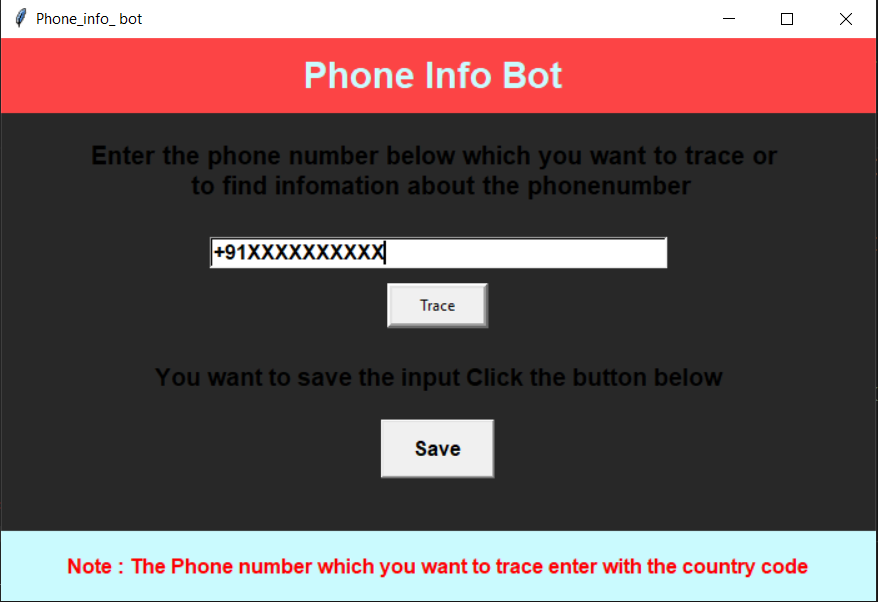

<h1 align="center">Hi I'm Cyber_Adi</h1>

## This tool is written in Python Language .

### With the help of this tool we can find information about fraud calls and of any number   This tool is helpful for those people who want to go in cyber field 

#### If you want to make changes with that tool you can .

#### some of the libraries used in this tool are :-

<li>Phonenumbers</li>
<li>Tkinter</li>
<li>os</li>

### For Installing it in your linux system
#### Open The Terminal and Run That command 

#### If you are Using a Kali linux operating system or other linux distribution then git and python is already installed in it . If it it not installed in you operating system then make sure it had been installed.

<code>git clone https://github.com/aditya12-cyber/Cyber_Tools/</code> 
<code>cd</code> 
<code>ls</code> 
<code>cd Cyber_Tools</code> 
<code>ls</code> 
<code>cd Phone_num_info</code> 
<code>ls</code> 
<code>python3 Phone_Info_Bot.py</code> 

### IF YOU LIKE 👍 That tool you can follow me on Github 

