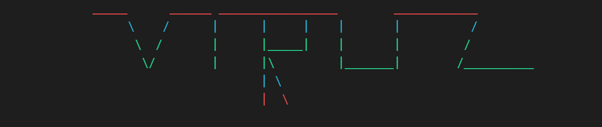

<H1 align="center"; ><strong> Hola 👋, I'm Cyber_Adi </strong></H1>

<H3><em> This is the Tool For those who want to make a fun with that : </em></H3>

<h3> This Program is written in <strong>PYTHON LANGUAGE</strong> and you want to make some changes with that you can make it   Some libraries or python modules which had been used in this tool are - </h3>

<H4>
<li>import colorama</li>
<li>import os</li>
<li>import time</li>
<li>from gtts import gTTS</li>
<li>import phonenumbers</li>
  
 
<em>Colorama is a python library which is used for coloring text in the terminal</em>

 
<em>OS is used for generally operating system works such as  Ex:- For creating  Files</em>
 

 
 
<em>GTTS means google text to search engine</em>
  

 
<em>OK from the following word you can understand it.... </em>
  
</H4>
